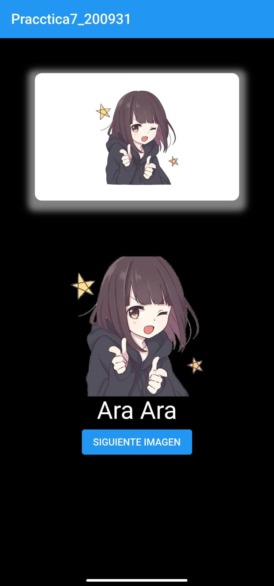
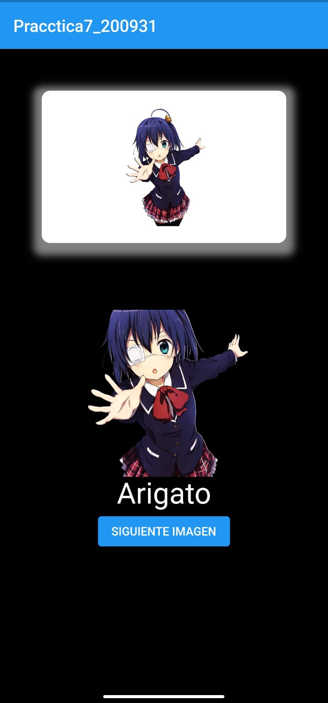

# Tarea5_200931 - Widget de Botón Personalizado Y Carrusel de imagenes

## Información General

- **Creado por:** Uriel Maldonado Cortez
- **Asignatura:** Desarrollo Movil Integral
- **Grado:** 10
- **Grupo:** A
- **Docente:** MTI. Marco Antonio Ramirez Hernandez
# Botón Personalizado y Carrusel de Imágenes en Flutter

Este proyecto de Flutter es un ejemplo simple de una aplicación que muestra un botón personalizado y un carrusel de imágenes. El botón personalizado cambia su texto cada vez que se presiona, y el carrusel de imágenes permite al usuario desplazarse a través de una serie de imágenes. La aplicación utiliza un StatefulWidget para mantener el estado interno y demostrar cómo actualizar la interfaz de usuario en respuesta a las interacciones del usuario.

## Capturas de Pantalla

  
  

## Funcionalidades Principales

- **Botón Personalizado**: La aplicación muestra un botón personalizado con un texto inicial de "Ara Ara". Cada vez que se presiona el botón, el texto cambia a partir de una lista predefinida de textos, incluyendo "Ara Ara", "YameteKudasai" y "Arigato".

- **Carrusel de Imágenes**: La aplicación presenta un carrusel de imágenes que permite al usuario desplazarse a través de una serie de imágenes. Las imágenes se cargan desde una lista de rutas de archivo predefinidas.

## Requisitos de Instalación

Antes de ejecutar esta aplicación, asegúrate de tener Flutter y Dart instalados en tu sistema. Luego, sigue estos pasos:

1. Clona este repositorio o descarga el código fuente.

2. Abre una terminal en la carpeta del proyecto.

3. Ejecuta el comando `flutter pub get` para obtener las dependencias necesarias.

4. Ejecuta `flutter run` para iniciar la aplicación en un emulador o dispositivo físico.

¡Gracias por explorar esta aplicación de ejemplo de Flutter! Si tienes alguna pregunta o necesitas más información, no dudes en ponerte en contacto con el autor del proyecto. ¡Diviértete desarrollando aplicaciones móviles con Flutter!
